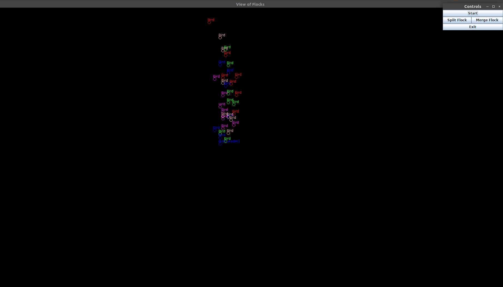

# Starling-Murmuration
It is a Java implementation of bird flock behaviour using MVC architechture and Object Oriented design.  
To see some interesting flock behaviour, you can check out a video on “murmuration”. Example:  
[https://www.youtube.com/watch?v=eakKfY5aHmY](https://www.youtube.com/watch?v=eakKfY5aHmY)  




## Instruction

1. ```$ javac TestFlock.java ```
2. ```$ java TestFlock```

